# COMP7640 E-Commerce Platform

## Overview
An e-commerce platform for multiple vendors and customers with a focus on personalized user experiences built with Python, FastAPI, Tkinter GUI, and MySQL. This system allows vendors to manage products, customers to browse and purchase items, and handles orders and transactions.

## Project Structure

```
\---ecommerce_platform 
    +---backend
    |   |   main.py # backend project starter
    |   +---dao # MVC Structure (sql definition)
    |   |   |   customer_dao.py
    |   |   |   order_dao.py
    |   |   |   product_dao.py
    |   |   |   transaction_dao.py
    |   |   |   vendor_dao.py
    |   |   |   __init__.py   
    |   +---models # MVC Structure (pydantic data structures)
    |   |   |   customer.py
    |   |   |   order.py
    |   |   |   product.py
    |   |   |   transaction.py
    |   |   |   vendor.py
    |   |   |   __init__.py           
    |   +---routes # MVC Structure (Controller: FastAPI)
    |   |   |   __init__.py        
    |   \---services # MVC Structure (The organization of business logic)
    |       |   customer_service.py
    |       |   order_service.py
    |       |   product_service.py
    |       |   transaction_service.py
    |       |   vendor_service.py
    |       |   __init__.py            
    +---database
    |       sample_data.sql
    |       schema.sql  
    \---frontend
        |   main_front.py # frontend project starter
        +---config
        |   |   app_config.py         
        +---controllers # Tab controller for each module like html+css
        |   |   other_tabs.py
        |   |   product_tab.py
        |   |   tab_controller.py
        |   |   vendor_tab.py        
        +---services # FastAPI connect with backend like js
        |   |   api_client.py
        |   |   async_api_client.py          
        +---ui
        |   |   base_components.py # Reusable UI Elements
```

## Prerequisites

```
fastapi==0.135.3
pydantic==2.12.5
pymysql==1.1.2
Requests==2.33.1
uvicorn==0.44.0
```

```
pip install -r requirements.txt
```

## Installation

### 1. Set up MySQL Database

​	Copy and paste contents of `database/ecommerce_platform.sql`, execute

### 2. Configure Database Connection
Edit `backend/routes/_init_.py` and update the `DB_CONFIG`:
```python
db_config = DatabaseConfig(
    host='localhost',
    port=3306,
    user='root',
    password='',
    database='ecommerce_platform'
)
```

## Running the Application

### 1. Start Backend Server
```bash
python backend/main.py
```
The backend will start on `http://localhost:8000`
API Documentation: `http://localhost:8000/docs`

### 2. Start Frontend (in a new Process)
```bash
python frontend/main_front.py
```


## Functional Modules Introduction

After launching the application, you can access the following functional modules:

### 1. Vendors Management Module

You can manage platform vendor information in this module:

| Browse vendor list: 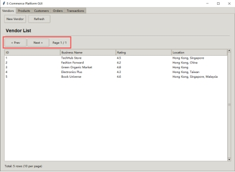You can browse the list of all vendors here, including their ratings and regions. | Create new vendor: 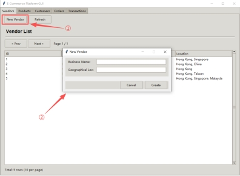After clicking on "New vendor", enter the vendor information in the newly popped up window to successfully create a new vendor. |
|------------------------------------------------------------------------------------------------------------------------------------------| ------------------------------------------------------------ |
|                                                                                                                                          |                                                              |

### 2. Product Catalog Management

You can manage product information in this module:

| Add new product: 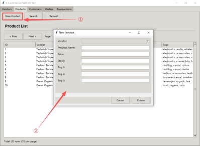Vendors can add new products here and fill in product information. | Product tag search: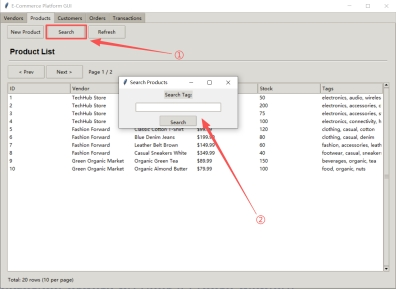 Vendors can search for different product tags here, and the search results will be displayed in real-time. |
|--------------------------------------------------------------------------------------------------------------------------|---------------------------------------------------------------------------------------------------------------------------------------------------------------------|
|                                                                                                                          |                                                                                                                                                                     |

### 3. Customer List and Registration

You can manage customer information in this module:

| - Browse customer list: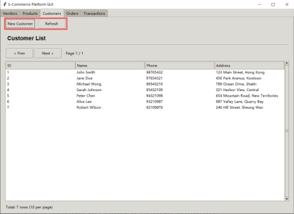  This page is used to browse customer information. | Customer registration: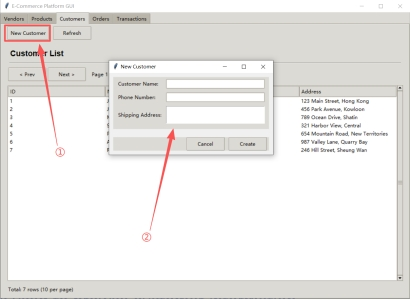 Customers can register and fill in their personal information here. |
|-----------------------------------------------------------------------------------------------------------------|---------------------------------------------------------------------------------------------------------------------------------|
|                                                                                                                 |                                                                                                                                 |

### 4. Order Status and Modifications

You can manage order information in this module:

| Create new order: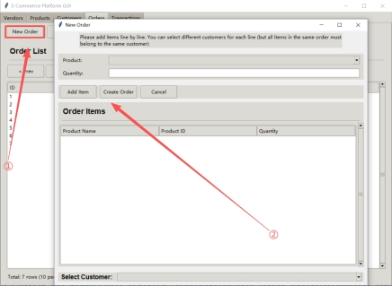 Create a new order by clicking on 'New order'. Fill in the order information in the newly popped up window. | Cancel order: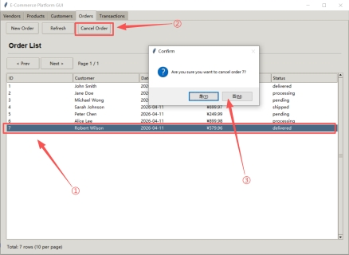 To cancel an order, you need to first click on the order you want to cancel, then click on "Cancel Order" and click on "Yes" in the new pop-up window. |
|--------------------------------------------------------------------------------------------------------------------------------------------------------------------|-----------------------------------------------------------------------------------------------------------------------------------------------------------------------------------------------------------|
| **Order Detail：**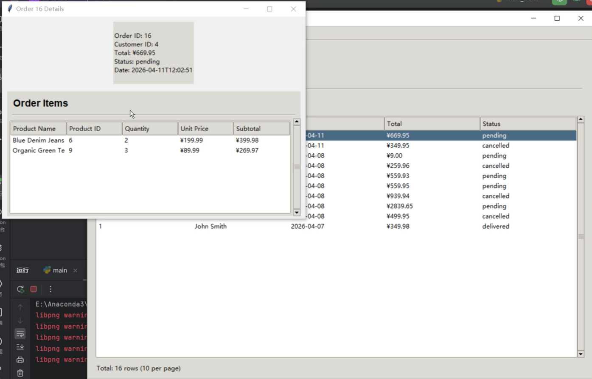**double click the order**             |                                                                                                                                                                                                           |

### 5. Transaction Record Query and Filtering

You can manage transaction records in this module:

| Browse transaction history: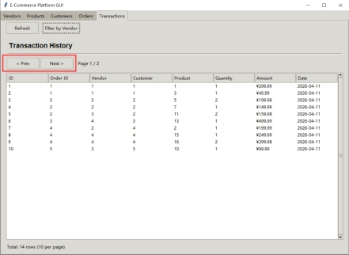 This page is used to browse the transaction history of orders. | Filter by vendor:!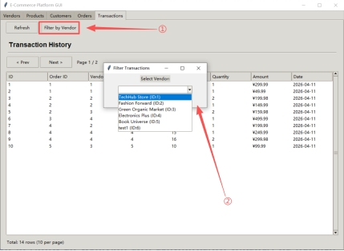Filter the vendors you want to browse by clicking on 'Filter by vendor'. |
|---------------------------------------------------------------------------------------------------------------------------------|---------------------------------------------------------------------------------------------------------------------------------|
|                                                                                                                                 |                                                                                                                                 |